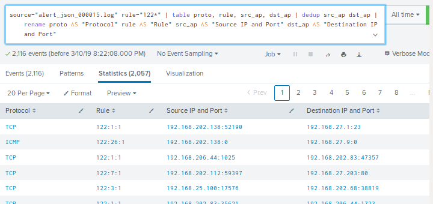

## SIEMs Day 2: Guided Practice - Using Tables in Splunk
--------

## Solution

-------

* Create a search that returns events for Snort rules starting with **122**.

* **Remove** any duplicate source or destination IPs.

* Create a **table** with the following fields:

    * protocol
    
    * rule
    
    * source and destination aps.

* Label the columns `Protocol`, `Rule`,`Source IP and Port` and `Destination IP and Port`.

* Answer: The search command is:  

```bash
  source="alert_json_000015.log" rule="122*" | table proto, rule, src_ap, dst_ap, 
  | rename proto AS "Protocol" rule AS "Rule" src_ap AS "Source IP and Port" dst_ap AS
   "Destination IP and Port" 
```

  

