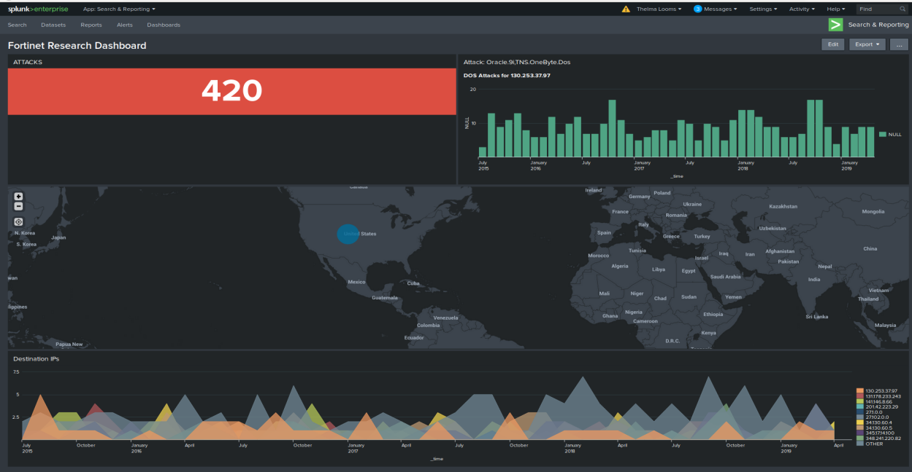

## SIEMs Day 3: Guided Practice - Visualizing Data from Firewall Attack Logs
--------

## Instructions

-------

Welcome to the Final Activity!  You may select a teammate to work with you on this exercise.

Your team prepared a **statistical report** for The Customer's digital forensics case.  You started by investigating *firewall attack log* event data that was collected for several years.  Now you are asked to summarize the report details for top management at the company.  You will create two *charts* and *map* to visualize your digital forensics results.

In this activity, you will use the `fortinet_logs_new.csv` file and create visual elements that will be added to a dashboard.

* Work with your teammate to **duplicate this dashboard** for the displaying information about the top attacker. Please ask your TA for assistance if you need help.

   

* First, upload the `fortinet_logs_new.csv` file into Splunk.

#### Here are the required visual elements:

**Time Chart**

* Create a **timechart** for the top `source IP` for the **DOS attacks by month**.

    * Hint: Here is the start of the timechart command
    
       ` | timechart count as ....`

* **Add the timechart** to a Dashboard called `Fortinet Research Dashboard`.

* Change the titles to:

   * Title: `Oracle.9i.TNS.OneByte.Dos`

   * Title: `Cluster Map`

**Attack Count**   

* Generate the `count` (420) using the `stats` command.

* **Add the count** to the dashboard.

**Map**

* Next generate a map for the top source IP ONLY. 

      Hint: Use the `iplocation` and `geostats` commands

* **Add the map** to the dashboard.

* Generate an area chart that displays the **targets** for the attack for the source IP address.

**Area Chart**

* **Add the area chart** to the dashboard. 

   * Hint: This should use a `timechart` using the destination IP and then `sort` descending by destination IP.

**User Interface**   

* Change the **color** of the `count` to red.

* Change the **background** for the dashboard.

* **Arrange the panels** as shown in the sample.

* Where are the attacks originating? 

### Activity Complete!