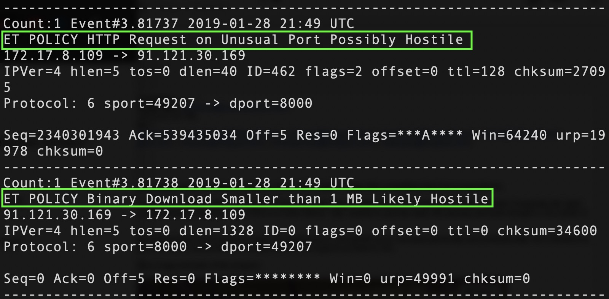
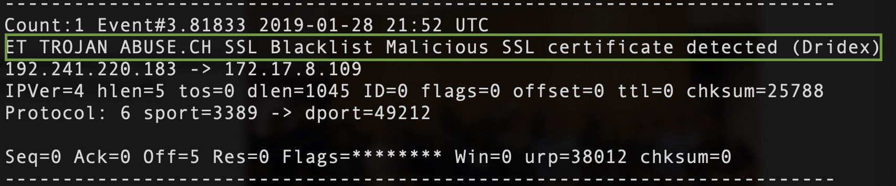
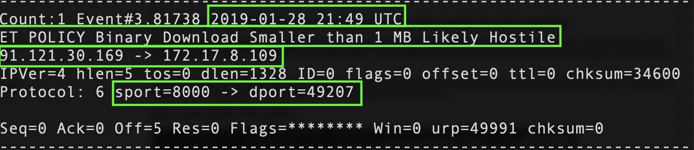
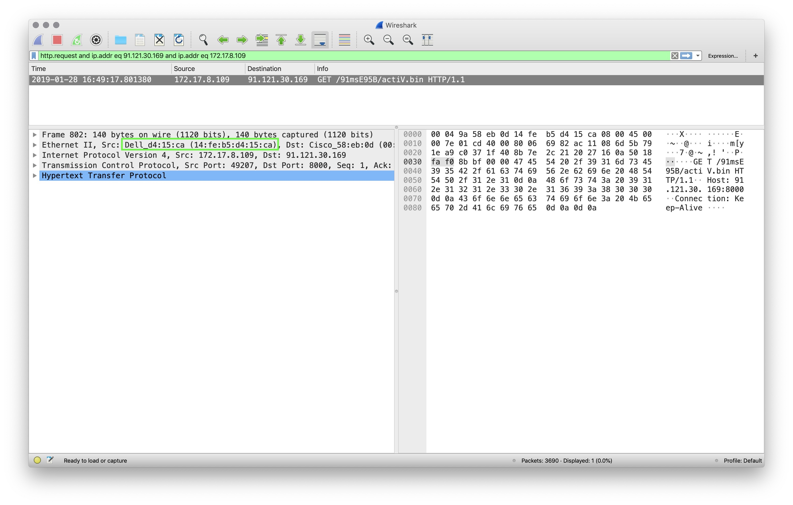
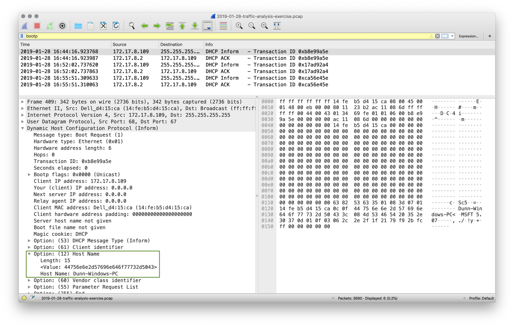
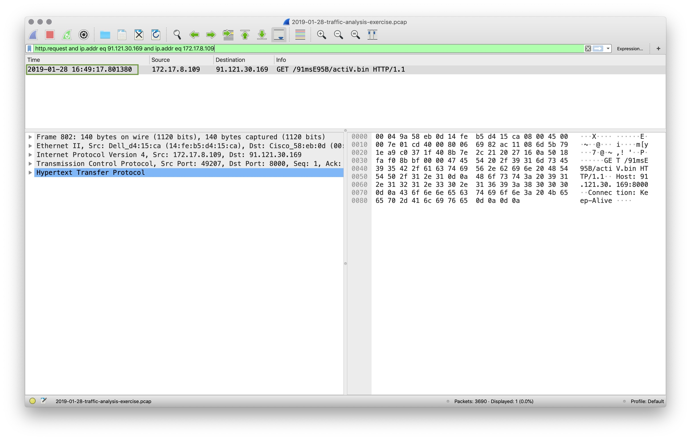
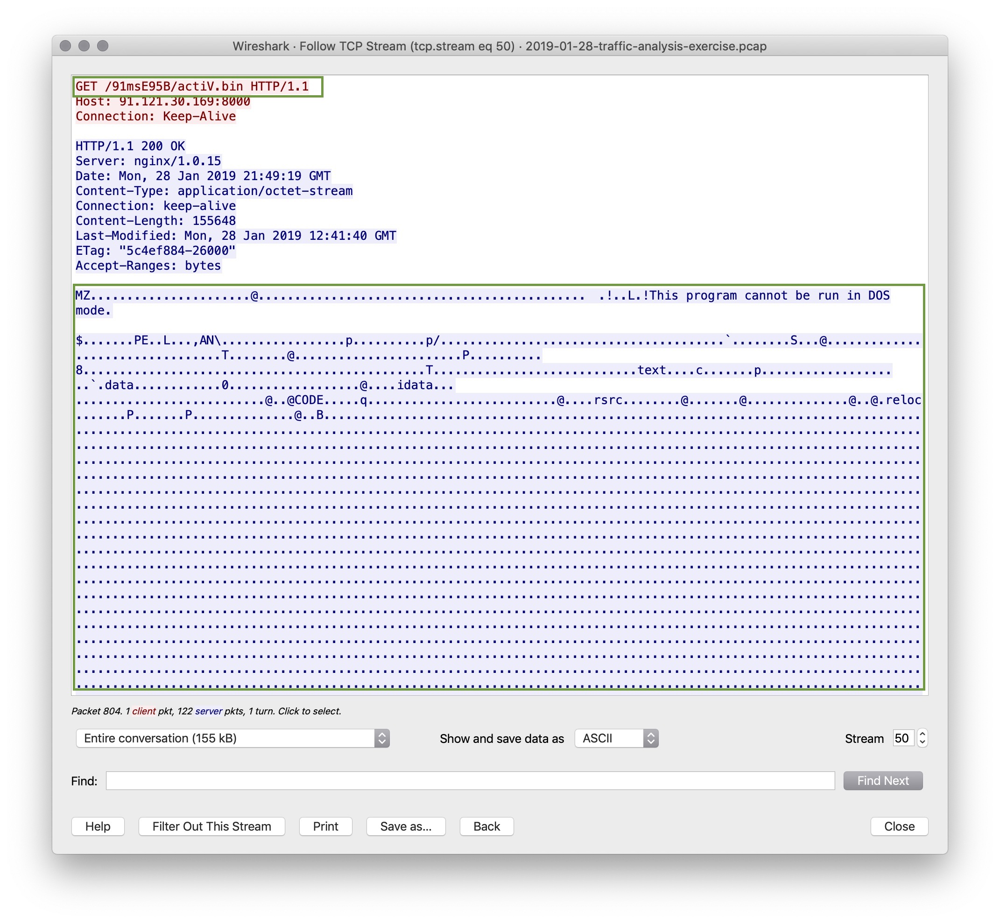
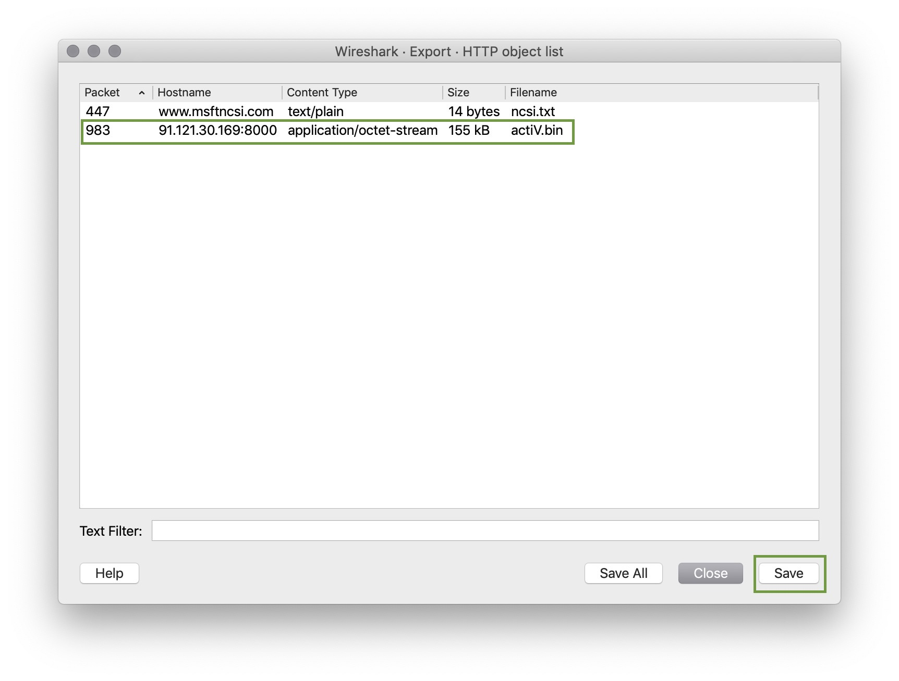
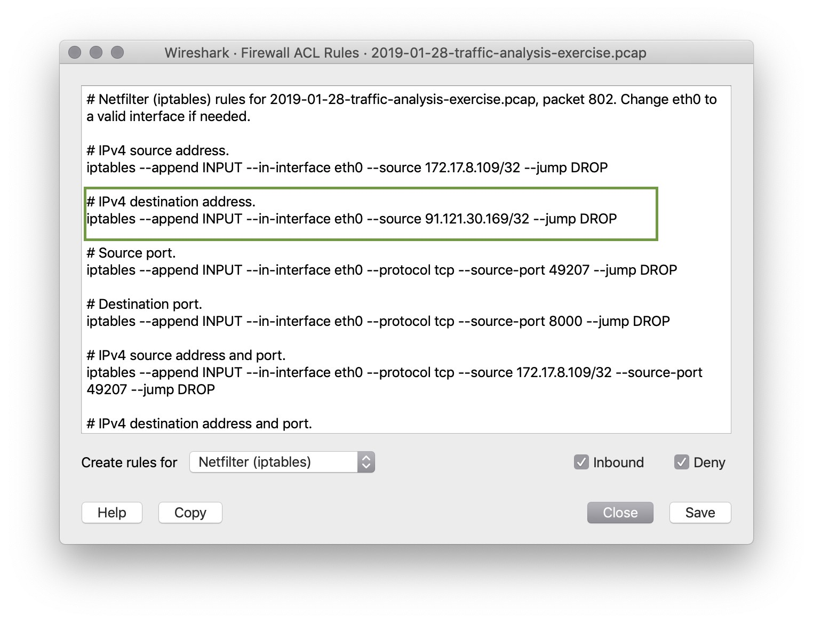

### Direct Instruction - !Alert 1! Review

Begin by examining the Snort file and answer these questions:

- What activity is snort reporting on? (Provide a few alert headlines)

    - "ET Policy HTTP Request on Unusual Port Possibly Hostile"

    - "WT Policy Binary Download Smaller than 1 MB Likely Hostile"
        - This is likely where malware was downloaded.

    

    - "ET TROJAN ABUSE.CH SSL Blacklist Malicious SSL Certificate detected (Dridex)"
        - This is the malware running

    

- What is the date and time of this alert?

    **Solution:** 2019-01-28 21:49 UTC

- What is the external IP address that snort is flagging for malicious activity?

    **Solution:** Using the second alert where the malware was likely downloaded, we see 91.121.30.169

- What is the internal IP address that snort is flagging for malicious activity?

    **Solution:** Using the same alert, we see 172.17.8.109

- What is the source port of the activity?

    **Solution:** 8000

- What is the destination port of the activity?

    **Solution:** 49207

    

Now, move into the pcap file.

- What is the MAC Address of the internal computer involved?

    **Solution:** `Dell (14:fe:b5:d4:15:ca)`

    

- What is the host name of the internal machine?

    **Solution:** Filter for `DHCP` traffic using `bootp`. `bootp` stands for `bootstrap protocol` and it is the protocol that DHCP traffic uses. Note that you can also filter for DHCP using `udp.port eq 68` to filter for traffic on port 68.

    **Solution:** Host name is `Dunn-Windows-PC`

    

- Filter the pcap file to show you the conversation between the two machines that were identified in the snort alert.

    **Solution:** `http.request and ip.addr eq 91.121.30.169 and ip.addr eq 172.17.8.109`

- Can you confirm the date and time this issue occurred?

    **Solution:** Filtering on http and ip addresses, we have a packet at `2019-01-28 16:49:17`

    

- How can you confirm if the snort alert is accurate?

    **Solution:** Follow the TCP stream and you can see the binary download starting with 'MZ' and '!This program cannot be run in DOS mode.'

    **Solution:** You can see the GET request ends in `/actiV.bin`

    

- Can you safely verify whether or not malware was downloaded?

    **Solution:** Using `File > Export Objects > HTTP` find the `actiV.bin` file and save it.

    **Solution:** Run `md5sum actiV.bin` to get a hash of the file

    **Solution:** Search the hash at [Virus Total](https://www.virustotal.com/#/home/search)

    

- Would you categorize this alert as a `False Positive` or a `True Positive`?

    **Solution:** We have verified that Malware was downloaded so this is a `True Positive`.

- If this issue needs to be mitigated, what steps should be taken with the infected machine?
    **Solution:** The machine should be restored to a backup prior to this infection.

- What steps should be taken in regards to network security?

    **Solution:** Using Wireshark `Tools > ACL Rules` we can get a rule for the offending IP:

    **Solution:** #IPv4 source address

    **Solution:** iptables --append INPUT --in-interface etho --source 91.121.30.169/32 --jump DROP

    
- Would you categorize this issue as a Web, Email or Network attack?

    **Solution:** This attack was carried out by the victim clicking on a malicious web link, so this is a `Web Attack`
