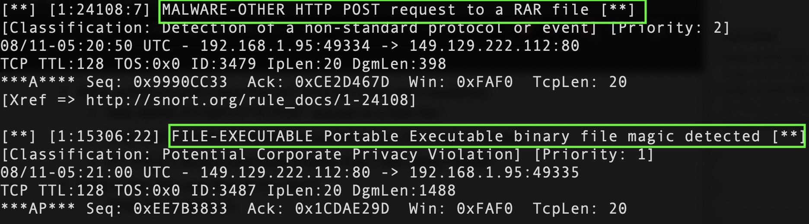
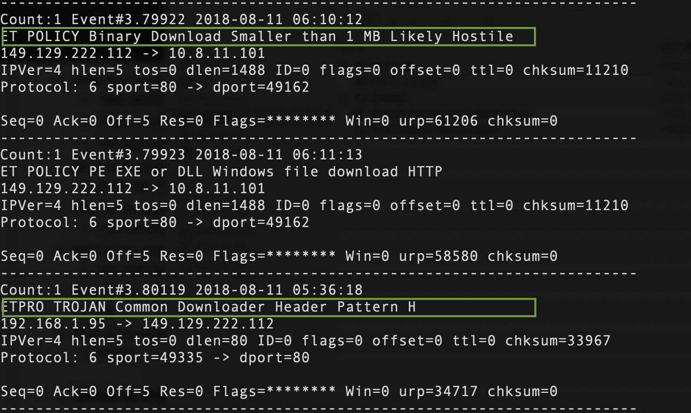
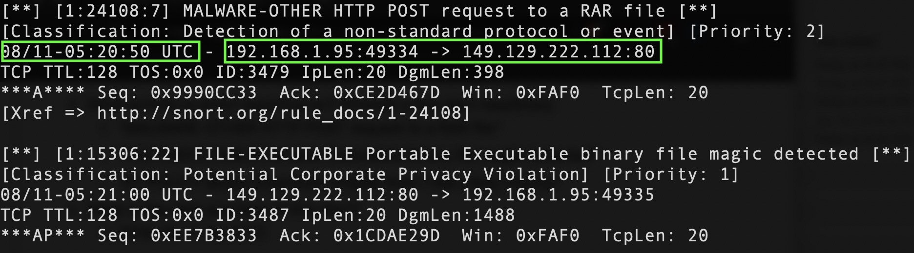
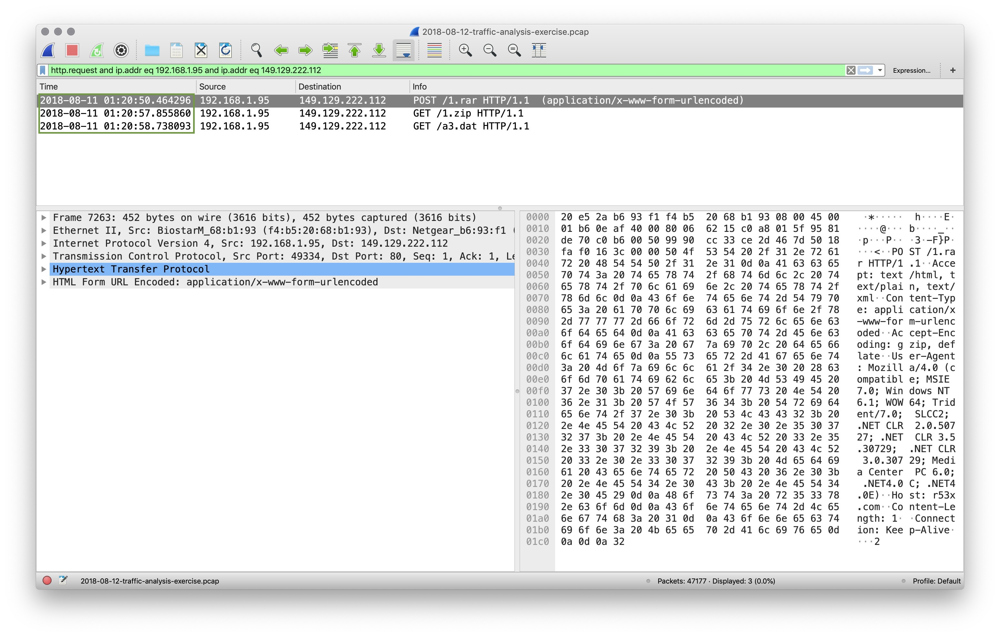
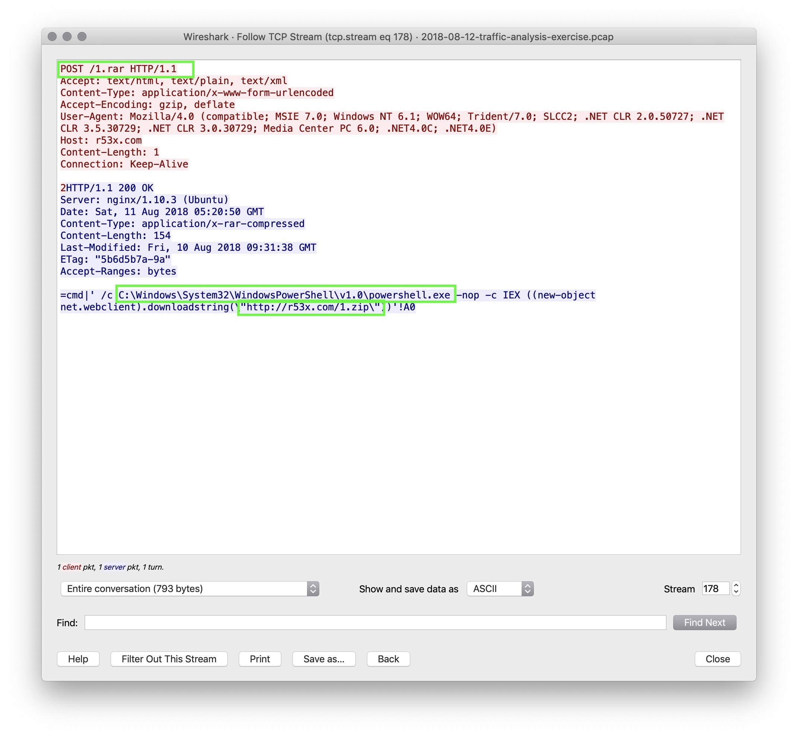
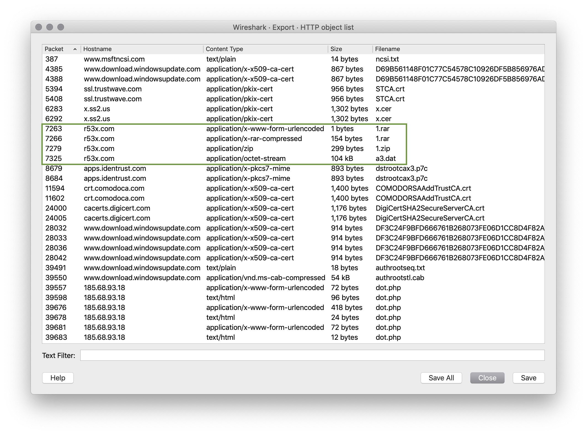
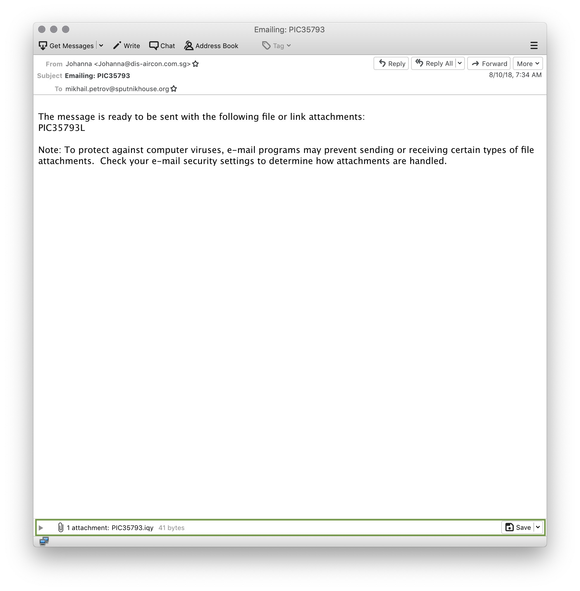
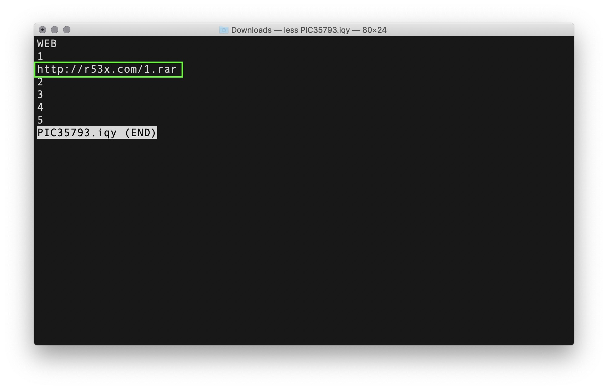
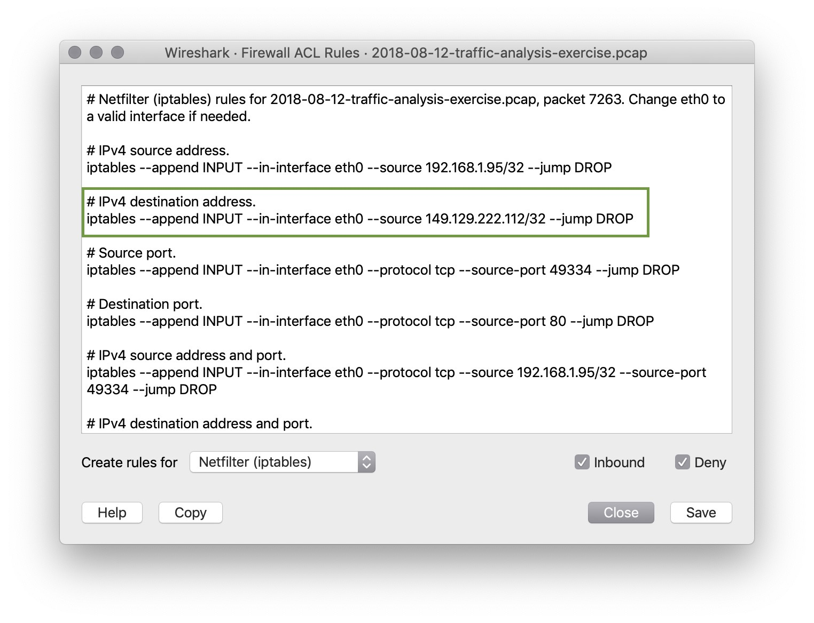

### Direct Instruction - !Alert 2! Review

- What activity is snort reporting on? (Provide a few alert headlines)

    - "MALWARE-OTHER HTTP POST request to a RAR file"

    - "FILE-EXECUTABLE Portable Executable binary file magic detected"

    - "ET POLICY Binary Download Smaller than 1 MB Likely Hostile"

    

    

- What is the date and time of this alert?

    **Solution:** 2018-08-11 06:10:12

  - What is the external IP address that snort is flagging for malicious activity?

    **Solution:** 149.129.222.112

  - What is the internal IP address that snort is flagging for malicious activity?

    **Solution:** 192.168.1.95

  - What is the source port of the activity?

    **Solution:** 49335

  - What is the destination port of the activity?

    **Solution:** 80

    

- What is the MAC Address of the internal computer involved?
    **Solution:** f4:b5:20:68:b1:93

- What is the host name of the internal machine?

    **Solution:** Filter for `bootp` in Wireshark and inspect the 'Option: Host Name' from an 'Inform' packet.

    **Solution:** 'Petrov2018-PC'

    

- Can you confirm the date and time this issue occurred?

    **Solution:** pcap file shows 2018-08-11 1:20 UTC

    

- How can you confirm if the snort alert is accurate?

    **Solution:** Following the TCP Stream of the machines in the alert shows a `POST` request to `/1.rar`

    **Solution:** The rest of the stream shows a powershell command that downloads an executable `r53x.com/1.zip`

    

- Can you safely verify whether or not malware was downloaded?

    **Solution:** Using `File > Export Objects > HTTP` you can export `1.zip` and `1.rar` files

    **Solution:** Verify this is malware using `md5sum` and [Virus Total](https://virustotal.com/#/home/search)

    

- Can you determine which email had a malware attachment related to the Snort Alerts?

    **Solution:** Locate the `.eml` activity files that you downloaded at the start of the exercise. Open each email by right-clicking and choosing 'Open with other application' > Thunderbird Mail

    **Solution:** Save all 3 attachments from each email in the activity directory.

    

    **Solution:** Use the `file` command to determine the file type of each file.

    **Solution:** One of the files (`PIC35793.iqy`) is a text file.

    **Solution:** Using the `less` command, we can see a link inside: `r53x.com/1.rar`

    **Solution:** The first email appears to be the culprit.

    

- Would you categorize this alert as a `False Positive` or a `True Positive`?

    **Solution:** This is categorized as a `True Positive` because we confirmed a malware infection.

- If this issue needs to be mitigated, what steps should be taken with the infected machine?

    **Solution:** The machine should be restored to a backup prior to this infection.

- What steps should be taken in regards to network security?

    **Solution:** We can block that IP Address using:

    **Solution:** `iptables --append INPUT --in-interface eth0 --source 149.129.222.112/32 --jump DROP`

    

- Would you categorize this issue as a Web, Email or Network attack?

    **Solution:** This started with an email attachment so this would be an `Email Attack`
