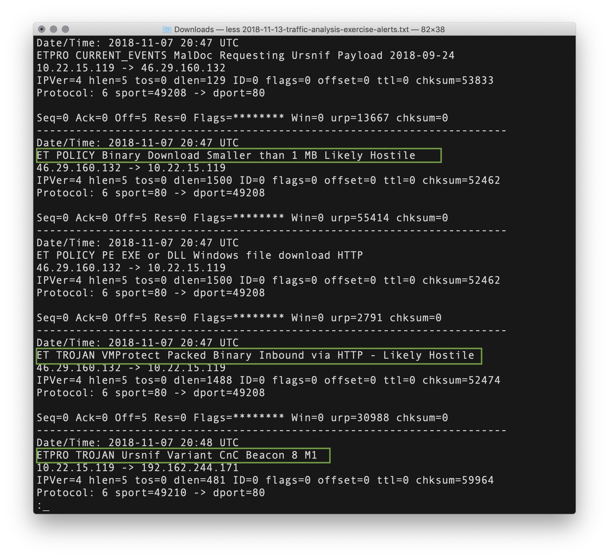
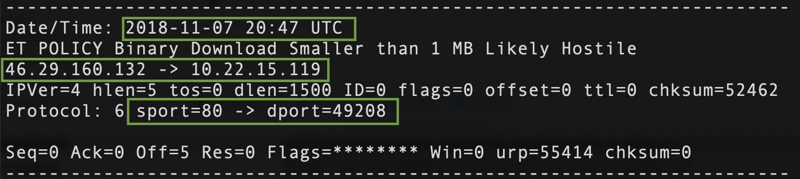
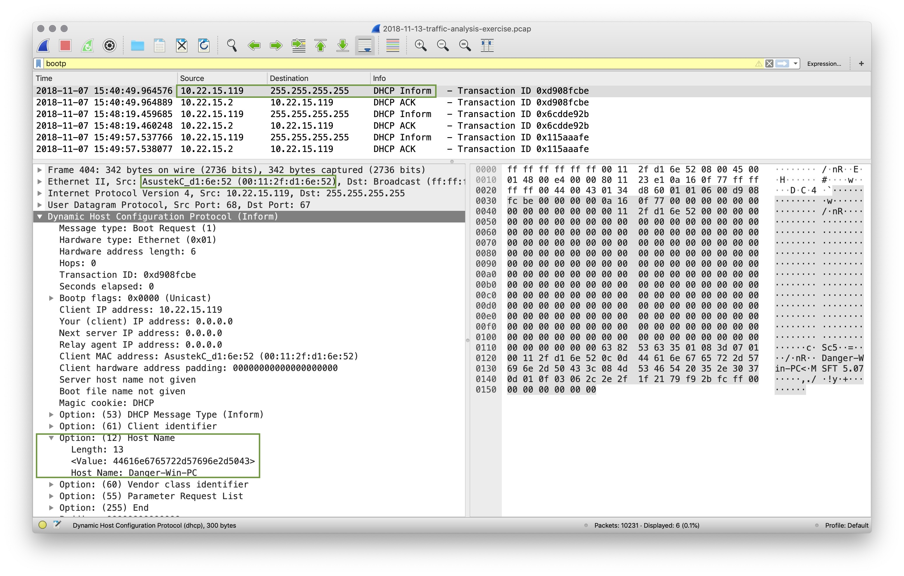
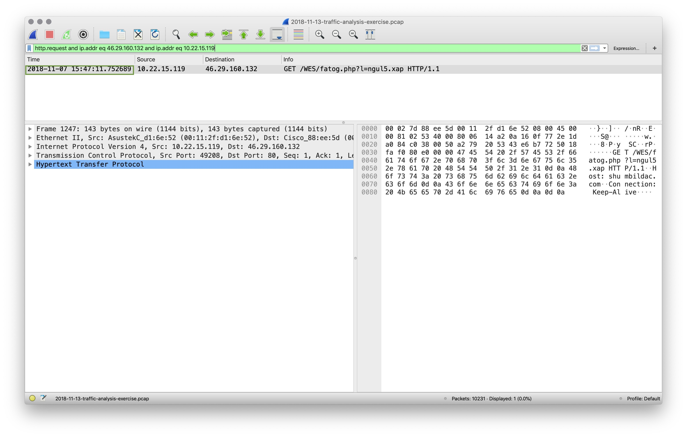
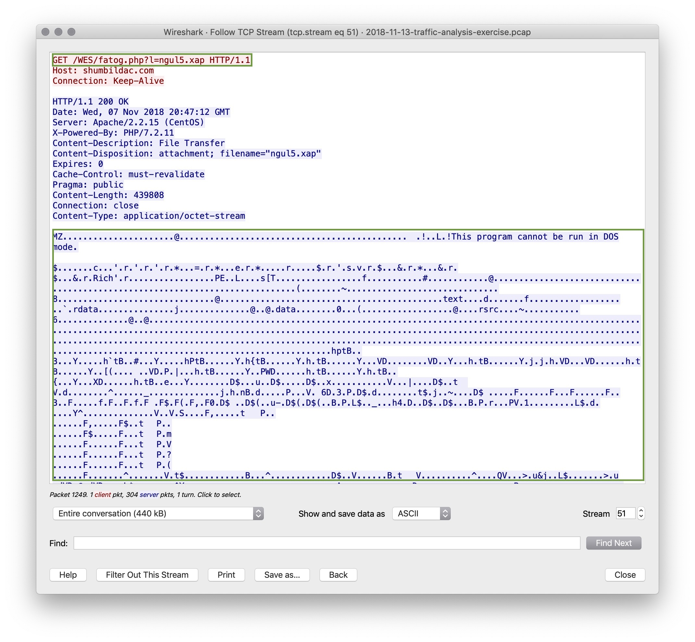
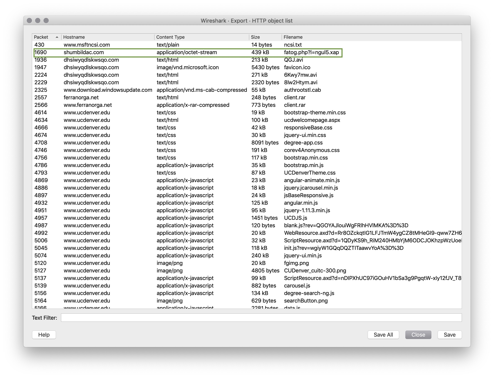

### Direct Instruction: !Alert 3! Review

Start by examining the Snort file and answer these questions:
    
- What activity is snort reporting on? (Provide a few alert headlines)
    
    -  "ET Policy Binary Download Smaller than 1 MB Likely Hostile"
    
    - "ET TROJAN VMProtect Packed Binary Inbound via HTTP - Likely Hostile"
    
    - "ETPRO TROJAN Ursnif Variant CnC Beacon 8 M1"
    
    
    
- What is the date and time of this alert?
    **Solution:** 2018-11-07 20:47 UTC
    
- What is the external IP address that snort is flagging for malicious activity?
   
    **Solution:** 46.29.160.132

- What is the internal IP address that snort is flagging for malicious activity?

    **Solution:** 10.22.15.119

- What is the source port of the activity?

    **Solution:** 80

- What is the destination port of the activity?

    **Solution:** 49208    

    

Now, move into the pcap file:

- What is the MAC Address of the internal computer involved?
    
    **Solution:** Asustek (possibly a mobile device)
    
    **Solution:** MAC (00:11:2f:d1:6e:52)

- What is the host name of the internal machine?
    
    **Solution:** Wireshark filter on `bootp` to get `DHCP` information
    
    **Solution:** Host Name is: Danger-Win-PC
    
    

- Filter the pcap file to show you the conversation between the two machines that were identified in the snort alert.

    **Solution:** `http.request and ip.addr eq 46.29.160.132 and ip.addr eq 10.22.15.119`

- Can you confirm the date and time this issue occurred?
    
    **Solution:** 2018-11-07 15:47:11

    
- How can you confirm if the snort alert is accurate?

    **Solution:** Following the TCP Stream shows a binary download "This program cannot be run in DOS mode."

    **Solution:** Binary file is `fatog.php?l=ngul5.xap`

    
    
- Can you safely verify whether or not malware was downloaded?
   
    **Solution:** Use `File > Export Objects > HTTP`
   
    **Solution:** Find `fatog.php?l=ngul5.xap` in the list and save it.

    **Solution:** Make an `md5sum` hash of the file and check with [Virus Total]()

    
    
- Would you categorize this alert as a `False Positive` or a `True Positive`?
    
    **Solution:** We have confirmed that Maleware was downloaded so this is a `True Positive`

- If this issue needs to be mitigated, what steps should be taken with the infected machine?
    
    **Solution:** The machine should be restored to a backup prior to this infection.
    
- What steps should be taken in regards to network security?
    
    **Solution:** Using wiresharks `Tools > Firewall ACL Rules` we can block the malicious IP
    
    **Solution:** #IPv4 Destination IP
    
    **Solution:** iptables --append INPUT --in-interface eth0 --source 46.29.160.132/32 --jump DROP

    

- Would you categorize this issue as a Web, Email or Network attack?
    
    **Solution:** This attack was propagated using a malicious Web Link so this is a `Web Attack`
