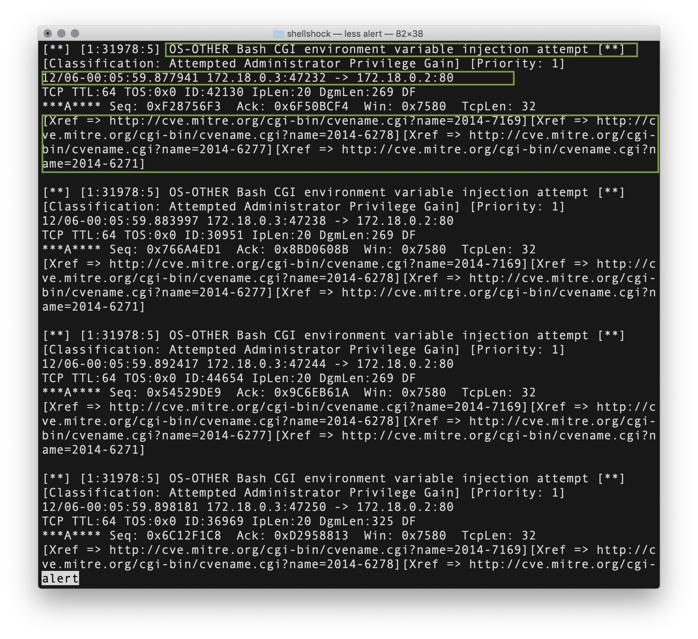
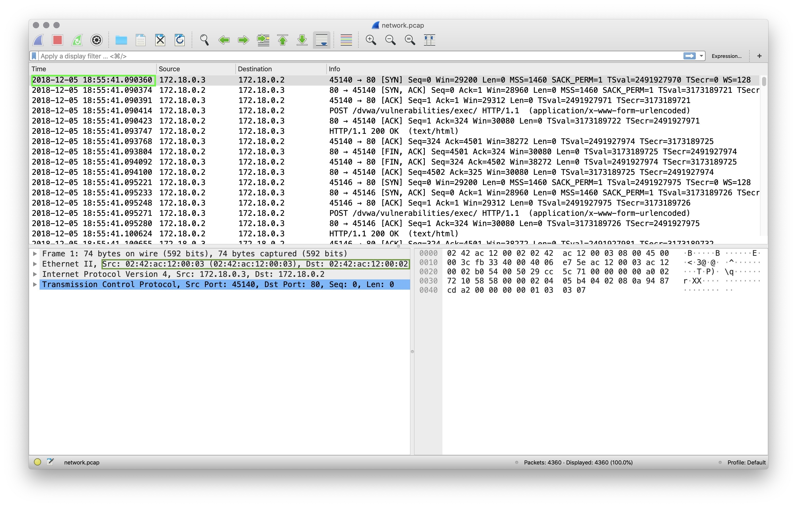
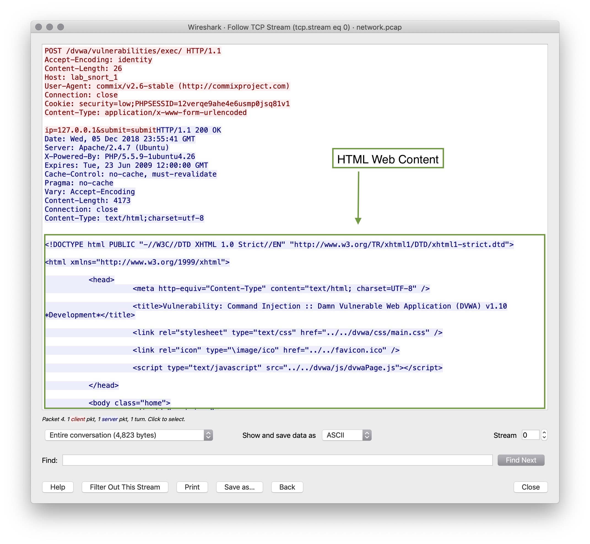
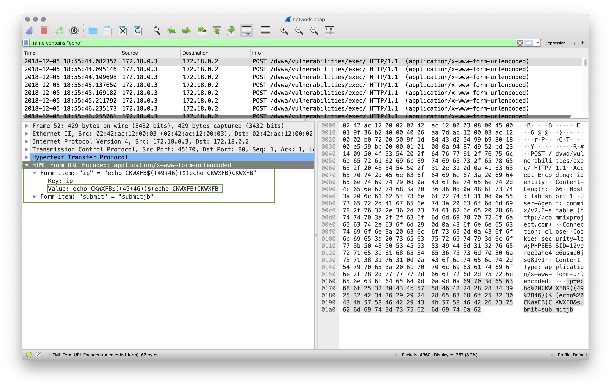
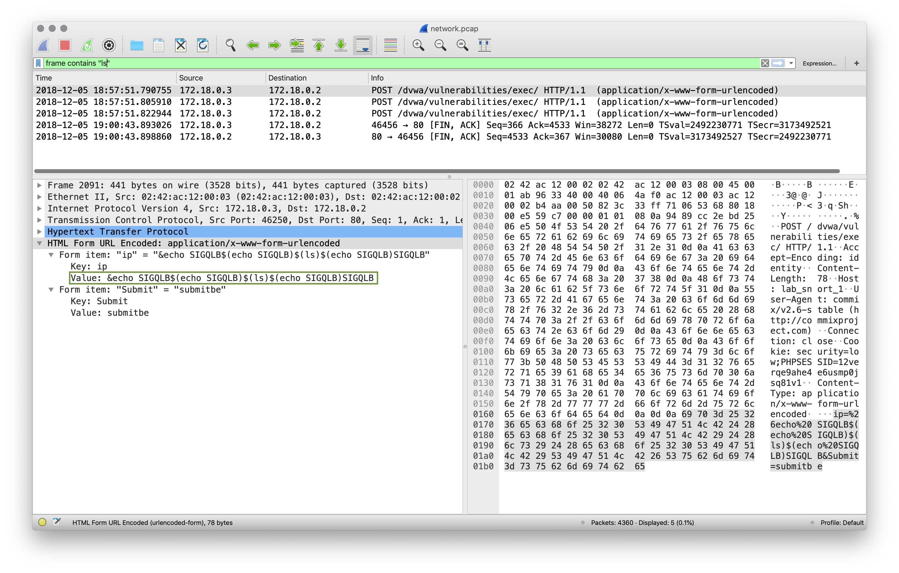
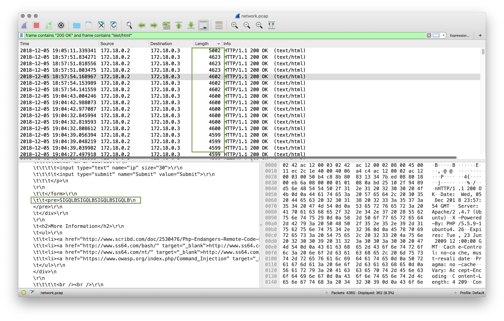

### Guided Practice - !Alert 4! Review
- What activity is snort reporting on? (Provide a few alert headlines)
    
    **Solution:**  "Attempted Administrator Privilege Gain"
    
    **Solution:** "OS-OTHER Bash CGI environment variable injection attempt"
- Is there a CVE associated with this alert?
    
    **Solution:** CVE-2014-6271
    
    **Solution:** CVE-2014-7169
    
    **Solution:** CVE-2014-6278
    
    **Solution:** CVE-2014-6277

- What are the IP Addresses flagged in this alert?
    
    **Solution:** 172.18.0.2 and 172.18.0.3

- Is this attack coming from outside the network?
    
    **Solution:** Both IP addresses are internal, so this is one internal machine attacking another.

- What is the source port of the activity?
    
    **Solution:** 47232

- What is the destination port of the activity?
    
    **Solution:** 80
    
    

- What are the MAC Addresses of the computers involved?
    
    **Solution:** 02:42:ac:12:00:02 and 02:42:ac:12:00:03

- Can you confirm the date and time this issue occurred?
    
    **Solution:** The attack started on 2018-12-05 at 18:55:41 UTC
    
    

- What was the target of this attack?
       
    **Solution:** The Bash CGI Variable Injection Attempt alert suggests that this is a possible bash code injection attack.
       
    Following the TCP stream of the first packet listed shows the contents of the webpage returned.
       
    This appears to be a code injection attack against an internal webserver from an internal machine.
    
    

- How can you confirm if the snort alert is accurate?
   
    **Solution:**  Filtering on "Frame contains '`bash-command`'" gives us many packets showing Bash command execution.
    
     Try `frame contains "echo"` and `frame contains ls`
    
     Under the `HTML Form URL Encoded:` section we can see values entered such as `&echo SIGQLB$(echo SIGQLB)$(ls)$(echo SIGQLB)SIGQLB`
    
    The alert is accurate in that we can see code injection attempts.
    
    
    
    

- Can you verify whether or not sensitive data has been obtained by the attacker?
        
    **Solution:** Filtering for `frame contains "200 OK" and frame contains "text/html"` we can see all of the information returned by the server in it's HTML content.
        
    Sorting the packets by `Length` we can see the largest packets returned which contain the most data.
    
    
    
    It appears that the attacker only listed the contents of the directory webpage directory but did not gain access to any sensitive data.

- Would you categorize this alert as a `False Positive` or a `True Positive`?
    
    **Solution:** This is still a `True Positive` because code injection was successful.

- If this issue needs to be mitigated, what steps should be taken with the infected machine?
    
    **Solution:** The internal machine that is doing the attacking needs to be further investigated.
    
    The web server application needs to be secured and data input better sanitized on this page.

- Would you categorize this issue as a Web, Email, Network or Application attack?
    
    **Solution:**This is a code injection attack on a Web Application. `Application Attack` is most appropriate.

Answer any questions they have before moving on.