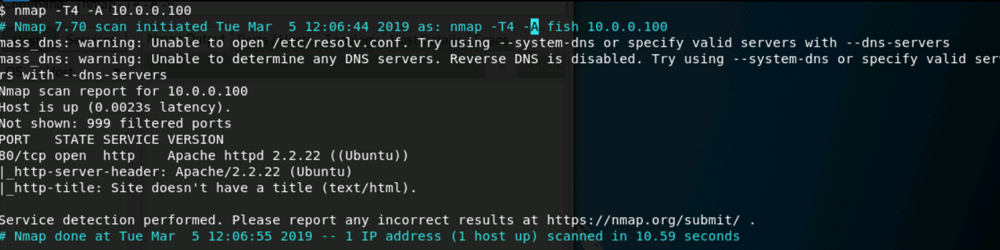

# Scanning and Enumeration
Launch the [Linux Exploitation](https://cybrscore.learnondemand.net/Lab/28535) lab. Then, follow the instructions below.

**Note**: You may need to browse to `https://cybrscore.learnondemand.net/CourseAssignment/355258` and search for `Linux Exploitation`.

## Instructions
- Start by using Zenmap to perform host discovery on the range `10.0.0.90-10.0.0.110`.
  > **Solution**: Use the command `nmap -sP 10.0.0.90-110`. You'll identify the hosts `10.0.0.100` and `10.0.0.101`. 

- Use Zenmap to perform an intense scan on any host you discover.
  > **Solution**: Use the command `nmap -T4 -A -v 10.0.0.100 10.0.0.101`. You'll find an Apache server on `10.0.0.100:80`, and interesting information about the SSL certificate backing `10.0.0.101:443`.

  

  
 
- Test both machines for vulnerability to Shellshock. 
   > **Solution**: Run `nmap -sV -p 80 --script http-shellshock --script-args uri=/cgi-bin/status.cgi 10.0.0.100,10.0.0.101`. You'll find that `10.0.0.100` is vulnerable.

- The `10.0.0.101` server is vulnerable to Heartbleed, which you'll exploit tomorrow. Use the Q & A section of the [Heartbleed website](http://heartbleed.com) to answer the following questions: 

    - Why it is called the Heartbleed Bug?

    - What makes the Heartbleed Bug unique?

    - What is being leaked?

    - What is leaked primary key material and how to recover?

    - What is leaked secondary key material and how to recover?

    - What is leaked protected content and how to recover?

    - What is leaked collateral and how to recover?

    - What versions of the OpenSSL are affected?

    - How common are the vulnerable OpenSSL versions?
    
    > **Solutions:** Refer to the Q & A section of the [Heartbleed website](http://heartbleed.com) for answers to these questions. 
    
**Reference**: http://heartbleed.com/
