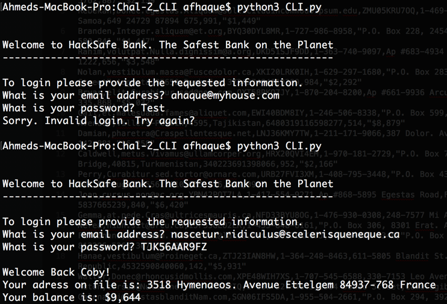

## Unit 5 Homework Assignment: HackSafe Bank

In this homework assignment, you will be using the concepts you've learned in class to implement hashing on a mock dataset that stores credit card and financial information. You must complete **Challenge 1**, while **Challenge 2** is a bonus.

Good luck! 

### Before You Begin

1. From within your Google Drive, create a folder called **04-Crypto_Challenge**. 

2. Right-click the **04-Crypto_Challenge** folder and select **Get Shareable Link**. You will use this folder to submit your homework when complete and the folder needs to be shareable so we can access it.

3. Inside your **04-Crypto_Challenge** folder, include two subfolders, one for each of the assignments.

## Challenge 1: Hash My Data

In this challenge, you've been given a csv file (UserInfo.csv) filled with rows of consumer financial information. Among the contents included are emails, passwords, credit card numbers, mailing addresses, phone numbers, and bank balances. Your job is to create a Python script that can iteratively loop through the contents and *hash* the confidential information (password and credit card number) from prying eyes. Your Python script should:

* Open the contents of UserInfo.csv using the Python CSV Library.

* Utilize the SHA256 hash strategy to mask password and credit card number.

* Store the hashed version of the data into a *new* file titled UserInfo_Hashed.csv.

Your final submission should come in the form of:
    
* Your complete Python script

* The original csv and the hashed csv (two separate files) 

* See the following screenshot for an excerpt of how your final csv should appear.

*Original CSV*

*Hashed CSV*

-----

## Challenge 2 (Bonus): Hash That Login 

In this challenge, you will use the UserInfo.csv file that you hashed in Challenge 1 as the basis of a Python command line interface (CLI) for users to login and access their records. Your CLI should:
    
* Prompt users for their email address and password.

* Hash the password provided using the SHA256 strategy.

* Compare the email and password provided against all records in the csv.

* If a match is found, the user should be greeted with their name, address, and bank balance.

* If no match is found, the user should be informed that their login attempt was invalid.

Your final submission should come in the form of:
    
* Your complete Python script   

* A screenshot of your CLI handling both a successful login and an unsuccessful login. (As a test "success" case, use the email address: nascetur.ridiculus@scelerisqueneque.ca password: TJK56AAR9FZ).

* See the following screenshot as a reference for how your CLI should appear.

## Hints and Considerations

* Heads-up! If your Python skills are shaky, you may struggle with these activities. But persevere! Work collaboratively with your peers and ask your Instructors and TAs for help if you get stumped on where to begin. While each activity involves a few challenges, the solution for each requires no more than 30-60 lines of code. Don't make this more complicated than necessary!

* For each of these activities, you should make use of the CSV and HashLib Python libraries. You will need to open the file in each challenge and read the contents line-by-line. The bulk of your encoding work will happen in the body of your "file open" block. 

* Remember, you can't *unhash* a hashed password. In challenge 2, your goal is to find a matching hash signature. 

* Use Google! There are plenty of bits of code you can borrow in completing this task.

* Good luck!

-----

## Copyright

Trilogy Education Services © 2018. All Rights Reserved.
